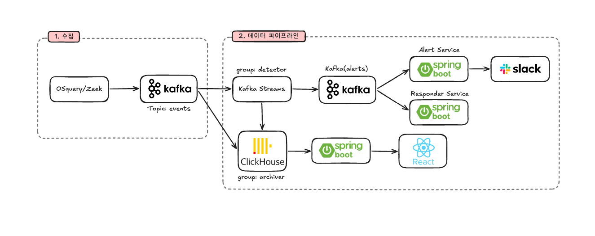

# EDRdog Backend

> 엔드포인트에서 수집한 행위 로그로 공격 시퀀스를 탐지하고, 그 기기의 프로세스를 실제로 종료하는 EDR 백엔드

## EDR 이란

**E**ndpoint **D**etection and **R**esponse. 개별 기기에서 벌어지는 일을 관찰해 위협을 찾아내고
대응까지 하는 보안 체계다.

| 단계 | 하는 일 | 사용 기술 |
|:---|:---|:---|
| **Endpoint** | 기기 안의 프로세스·파일·네트워크 활동을 관찰해 서버로 보낸다 | osquery, Zeek |
| **Detection** | 모아진 활동에서 공격을 판정한다 | Kafka, Kafka Streams |
| **Response** | 판정된 위협에 실제로 대응한다 | Fleet |

### 백신과의 차이

- **백신**은 파일이 **무엇인지** 본다. 알려진 악성코드의 지문과 대조한다
- **EDR**은 파일이 **무엇을 했는지** 본다. 무엇을 실행했고 어디에 접속했는지, 어떤 순서로 했는지를 본다

```
백신    이 파일이 악성코드 목록에 있나?
EDR     이 파일이 방금 외부에서 받아온 것이고, 받자마자 실행됐나?
```

지문이 없는 새로운 공격은 백신을 통과한다. EDR 은 행위를 보기 때문에 개별로는 정상인 행동의
조합을 잡아낼 수 있다.

## 아키텍처



## 1. Endpoint

### osquery: 프로세스와 파일

운영체제의 상태를 SQL 테이블처럼 다루는 에이전트다. 이 시스템은 그중 **evented table** 을 쓴다.

| | 동작 | 한계 |
|:---|:---|:---|
| 일반 테이블 | 질의하는 그 순간의 스냅샷 | 조회와 조회 사이에 뜨고 사라진 프로세스를 놓친다 |
| evented table | 커널이 흘려보내는 사건을 계속 받아 쌓음 | 플랫폼별 권한 설정이 필요하다 |

공격 도구는 대개 짧게 실행되고 사라진다. 폴링이 아니라 이벤트 구독이어야 하는 이유다.

사건을 주는 주체는 플랫폼마다 다르다.

| | 프로세스 | 파일 |
|:---|:---|:---|
| macOS | EndpointSecurity | FSEvents |
| Windows | ETW | NTFS USN 저널 |

수집한 로그는 **TLS remote** 플러그인으로 서버에 보낸다.

- osquery 가 서버 인증서를 **고정(pinning)** 한다. 지정한 그 인증서일 때만 붙는다
- 서버는 조직마다 다른 **enroll secret** 으로 그 기기가 어느 조직 것인지 판별한다

### Zeek: 네트워크

네트워크 트래픽을 직접 읽어 연결 기록을 남기는 도구다. 네트워크만 따로 Zeek 를 쓰는 이유는
osquery 로는 못 하기 때문이다.

- **macOS**: 소켓 이벤트 테이블이 OpenBSM 기반인데 신형 macOS 에서 사실상 비어 있다
- **Windows**: 실시간 소켓 테이블 자체가 없다

Zeek 가 만든 `conn.log` 는 osquery 로그와 같은 형식으로 바꿔 같은 경로로 보낸다.

- 같은 enroll secret 을 쓴다
- 같은 host 이름을 쓴다
- 그래서 서버에서는 한 기기의 이벤트로 합쳐진다

### 왜 둘을 같이 쓰나

기술적으로는 osquery 가 네트워크를 못 주기 때문이지만, 설계로 보면 **보는 각도가 다르기**
때문이다.

| | 보는 것 | 알 수 없는 것 |
|:---|:---|:---|
| osquery | 기기 **안**. 어떤 프로세스가 무엇을 실행하고 어떤 파일을 건드렸나 | 그 프로세스가 어디와 통신했나 |
| Zeek | 기기 **밖**. 어디로 얼마나 연결했나 | 그 연결을 누가 만들었나 |

하나만으로는 공격의 절반만 보인다.

- osquery 만 있으면: 파일이 실행된 건 알지만 그게 방금 외부에서 받아온 것인지 모른다
- Zeek 만 있으면: 외부에서 뭔가 받은 건 알지만 그것을 실행했는지 모른다

이 시스템에서 가장 심각도가 높은 **R2(다운로드 후 실행)** 가 정확히 두 관점을 합쳐야 성립하는
룰이다. 그래서 둘을 같은 host 이름으로 묶어 하나의 타임라인에 세운다.

## 2. Detection

### Kafka: 수집과 판정을 분리

엔드포인트가 보낸 로그는 곧장 판정으로 가지 않고 Kafka 토픽에 쌓인다.

| 얻는 것 | 설명 |
|:---|:---|
| 완충 | 판정이 느려지거나 재시작해도 수집이 멈추지 않는다 |
| 분기 | 같은 스트림을 판정(detector)과 저장(archiver)이 각자의 속도로 나눠 읽는다 |
| 재처리 | 룰을 고친 뒤 오프셋을 되돌려 과거 이벤트를 다시 판정할 수 있다 |

### 메시지를 디스크에 남긴다

Kafka 는 메시지를 메모리 큐가 아니라 디스크의 **append-only 로그**에 쓴다. 전통적인 메시지 큐가
소비되면 지우는 것과 달리, 컨슈머가 읽어가도 보존 기간 동안 그대로 남는다.

여기서 따라오는 것들:

- 컨슈머가 죽어도 그동안 쌓인 메시지가 남아 있다. 다시 떠서 마지막 오프셋부터 이어 읽는다
- 오프셋을 되돌리면 이미 읽은 구간을 다시 읽을 수 있다
- 같은 메시지를 여러 **컨슈머 그룹**이 각자의 오프셋으로 읽는다

마지막 항목이 이 시스템의 구조를 만든다. `events` 토픽 하나를 detector 그룹과 archiver 그룹이
각각 읽어서, 판정과 저장이 서로의 속도에 영향을 주지 않는다.

### 디스크에 쓰는데 왜 빠른가

- **순차 쓰기**: 로그가 append-only 라 쓰기가 항상 파일 끝에 붙는다
- **순차 읽기**: 컨슈머도 오프셋 순서대로 읽는다
- 디스크는 임의의 위치를 찾아가는 랜덤 접근이 느리지, 순차 접근은 그렇지 않다

여기에 두 가지가 더해진다.

- **페이지 캐시**: 자체 캐시를 만들지 않고 OS 페이지 캐시를 그대로 쓴다. 방금 쓴 데이터를 바로
  읽어가는 컨슈머는 디스크까지 가지 않고 메모리에서 받는다
- **zero-copy**: 디스크의 데이터를 네트워크로 보낼 때 애플리케이션 메모리로 복사하지 않고 커널
  안에서 바로 전달한다

### 토픽 설정

| 토픽 | 파티션 | 복제 계수 | 담는 것 |
|:---|:---:|:---:|:---|
| `events-raw` | 3 | 1 | osquery, Zeek 가 보낸 원본 로그 |
| `events` | 3 | 1 | 정규화된 이벤트 |
| `alerts` | 3 | 1 | 판정 결과 |

**파티션을 3으로 둔 이유**

- 파티션은 병렬 처리의 단위다. 한 컨슈머 그룹 안에서 파티션 하나는 컨슈머 하나가 맡는다
- 파티션 수보다 컨슈머를 많이 띄워도 남는 쪽은 논다. 즉 **파티션 수가 병렬성의 상한**이다
- 지금은 서비스마다 인스턴스가 하나라 한 인스턴스가 3개를 모두 읽는다
- 부하가 늘면 코드를 고치지 않고 인스턴스를 3대까지 늘릴 수 있다

**파티션 수는 함부로 바꾸지 않는다**

- 늘릴 수는 있어도 줄일 수 없다
- 키 기반 파티셔닝에서는 파티션 수가 바뀌면 같은 키가 다른 파티션으로 배정된다
- host 를 키로 쓰는 이 시스템에서는 그 순간 한 기기의 이벤트가 두 파티션으로 갈라져 순서 보장이 깨진다

**복제 계수가 1인 이유**

- 브로커가 한 대이기 때문이다. 같은 노드에 복제해봐야 그 노드가 죽으면 함께 사라진다
- 운영 환경이라면 브로커 3대에 복제 계수 3이 기본이다. 그래야 한 대가 죽어도 다른 복제본이
  리더를 넘겨받아 유실 없이 이어진다
- 이 설정에서 유실에 강한 것은 **컨슈머 장애**까지다. 브로커 장애는 대비되어 있지 않다

보존 기간은 기본값(7일)을 쓴다.

### Kafka Streams: 상태를 들고 판정

룰이 한 건만 보고 판단한다면 스트림 처리가 필요 없다. 그런데 공격은 여러 행동의 **순서**로
드러난다.

```
파일 다운로드            정상. 매일 일어난다
파일 실행                정상. 매일 일어난다
받아온 그 파일을 실행     의심스럽다
```

- host 별로 최근 이벤트를 버퍼에 들고 있는다
- 새 이벤트가 올 때마다 그 버퍼와 대조한다
- 윈도우는 5분이다

판정 결과는 **MITRE ATT&CK** 기법 번호로 매핑한다. 공격 기법을 부르는 공통 언어라서 탐지 내용을
설명할 때 서로 다른 도구끼리도 말이 통한다.

| 룰 | 무엇을 잡나 | 기법 |
|:---|:---|:---|
| R1 | 오피스 문서가 shell 을 띄움 | T1059 |
| R2 | 외부에서 받아온 파일을 실행 | T1105 + T1204 |
| R3 | 임시나 다운로드 경로에서 스크립트 실행 | T1059 |
| R4 | 자동실행 경로에 파일 생성 | T1547 |

### Kafka Streams 를 어떻게 구성했나

Kafka Streams 는 별도 클러스터가 필요한 프레임워크가 아니라 **애플리케이션에 붙는 라이브러리**다.

- Flink 나 Spark 는 잡 매니저와 워커로 이루어진 클러스터를 따로 운영해야 한다
- Kafka Streams 는 서비스 프로세스 안에서 함께 돈다
- 처리량을 늘리려면 서비스 인스턴스를 늘리면 되고, 그때 파티션이 자동으로 재분배된다

| 개념 | 이 프로젝트의 값 | 무엇인가 |
|:---|:---|:---|
| `application.id` | `detector` | 컨슈머 그룹 ID 이자 내부 토픽 이름의 접두어 |
| 리파티션 토픽 | `events-by-host` | 키를 바꾼 뒤 다시 나누기 위한 내부 토픽 |
| 상태 저장소 | `persistentKeyValueStore` | host 별 이벤트 버퍼. RocksDB 기반 |
| 태스크 | 파티션 수만큼 | 파티션 3개면 태스크 3개가 만들어져 스레드에 배정된다 |

**리파티션**

- 상관분석은 같은 host 의 이벤트가 한 군데 모여야 성립한다
- `selectKey` 로 키를 바꿔도 레코드는 원래 파티션에 그대로 있다. 이름표만 바뀐 셈이다
- 그래서 내부 토픽으로 한 번 내보냈다가 다시 읽는다. 이때 새 키 기준으로 자리가 정해진다

지금은 `events` 에 넣는 쪽이 모두 host 를 키로 쓰고 있어서 실제로 재분배가 일어나지는 않는다.
그래도 이 단계를 두는 것은 생산자가 키를 수정하거나 삭제해도 상관분석이 깨지지 않게 하기
위해서다. 대가는 내부 토픽을 한 번 거치는 지연이다.

**상태 저장소와 changelog**

- 버퍼는 각 인스턴스의 로컬 디스크(RocksDB)에 있다. 메모리에만 두면 재시작할 때 사라진다
- 동시에 Kafka Streams 가 상태 변경을 **changelog 토픽**에 기록한다
- 인스턴스가 죽으면 파티션을 넘겨받은 쪽이 이 기록을 되짚어 상태를 복원한다

**DSL 과 Processor API**

| | |
|:---|:---|
| **DSL** | `map`, `filter` 같은 정해진 연산을 조립한다 |
| **Processor API** | 레코드 하나하나를 직접 다룬다 |

이 시스템은 버퍼를 앞뒤로 훑고, 상관에 쓰일 이벤트만 남기고, 윈도우 밖의 것을 그때그때 지운다.
DSL 의 정해진 연산으로는 표현되지 않아서 Processor API 로 직접 작성했다.

### 순서 보장

Kafka 는 **파티션 안에서만** 순서를 보장한다. 파티션이 여럿이면 토픽 전체의 순서라는 것은 없다.
그래서 두 가지를 한다.

**첫째, 파티션 키를 host 로 둔다**

- 같은 키는 같은 파티션으로 가므로 한 기기가 보낸 이벤트는 발행한 순서대로 읽힌다
- 상관분석은 어차피 기기 단위라서 다른 기기와의 순서는 필요하지 않다
- 판정 단계에서도 host 로 다시 키를 잡아 한 기기의 상태를 한 처리기가 도맡는다

**둘째, 판정은 도착 순서가 아니라 발생 시각으로 한다**

파티션을 나눠도 도착 순서가 발생 순서와 같다는 보장은 없다.

- 소스가 osquery 와 Zeek 둘이다
- 특히 **Zeek 는 연결이 끝나야 로그를 쓴다.** TCP 정상 종료 기준으로 약 5초 뒤다

```
실제로 일어난 순서    [다운로드]  →  [실행]
서버에 도착한 순서    [실행]      →  [다운로드]     네트워크 로그가 늦게 온다
```

도착 순서로 "다운로드 다음에 실행"을 찾으면 이 조건은 영영 성립하지 않는다. 실행 로그가 항상
먼저 도착하기 때문이다.

그래서 시각을 **Kafka 에 넣기 전, 엔드포인트에서 찍힌 값**으로 쓴다.

| 소스 | 시각의 출처 | 의미 |
|:---|:---|:---|
| osquery | result-log 의 `unixTime` | 그 사건이 기기에서 일어난 시각 |
| Zeek | `conn.log` 의 `ts` | 연결이 시작된 시각 (기록은 종료 후) |

- 서버가 받은 시각이 아니다
- 전송이 지연되든 순서가 뒤바뀌든 사건들 사이의 시간 관계는 그대로 남는다
- 버퍼도 이 시각으로 훑는다. 새 이벤트보다 앞선 것뿐 아니라 뒤선 것까지 양쪽으로 본다

### 중복은 어떻게 다루나

Kafka Streams 의 기본 처리 보장은 **at-least-once** 다. 장애나 리밸런스로 오프셋 커밋 전에 재시작하면
같은 이벤트를 다시 처리한다. 즉 같은 판정이 두 번 나올 수 있다.

exactly-once 를 켜는 선택지가 있지만 쓰지 않았다.

- 트랜잭션 코디네이터가 붙어 처리량이 떨어지고 지연이 늘어난다
- **중복 판정 자체가 문제가 아니라 중복 알림이 문제**다. 그쪽에서 막는 편이 싸다

그래서 알림 단계에서 억제한다.

| | 값 |
|:---|:---|
| 억제 키 | 수신 대상 + host + ruleId |
| 억제 창 | 60초 |

두 가지를 신경 썼다.

- **처리하는 시점의 현재 시각이 아니라 알림에 실린 이벤트 시각으로 판단한다.** 현재 시각을 쓰면
  같은 입력을 재처리했을 때 결과가 달라진다. 이벤트 시각을 쓰면 몇 번을 다시 돌려도 같은 결과가
  나온다
- **발송에 실패하면 쿨다운을 되돌린다.** 실패했는데 쿨다운을 소모하면 그 60초 동안 그 알림은
  아예 전달되지 않는다. 실패는 억제 대상이 아니다

**중복 거르는 방법**

쿨다운 기록은 Redis 같은 외부 저장소가 아니라 인스턴스 안의 메모리에 있다. 그런데도 인스턴스를
늘릴 수 있는 이유는 파티셔닝에 있다.

```
alerts 토픽 파티션 키 = host   (판정 단계의 스트림 키가 그대로 실림)
   ↓
같은 host 알림 = 항상 같은 파티션
   ↓
컨슈머 그룹 alert 안에서 그 파티션은 한 인스턴스가 맡음
   ↓
같은 host 알림은 늘 같은 인스턴스가 처리 = 로컬 맵으로 충분
```

리밸런스 직후나 재시작 직후에는 이전 기록이 없어 한 번 더 갈 수 있다. 알림이 한 번 더 가는
정도라 저장소를 하나 더 두는 것보다 낫다고 봤다.

### ClickHouse 와 MySQL

| | 담는 것 | 이유 |
|:---|:---|:---|
| **ClickHouse** | 이벤트와 판정 기록 원본 | 컬럼 지향이라 집계할 때 필요한 컬럼만 읽는다. 계속 쌓이고 수정하지 않는 로그 데이터에 맞다 |
| **MySQL** | 계정, 조직 설정, 알림 처리 상태 | 건건이 수정되고 트랜잭션이 필요하다 |

알림 목록은 ClickHouse 의 판정 기록 위에 MySQL 의 처리 상태를 겹쳐서 보여준다.

## 3. Response

### Fleet: 원격 명령 실행

탐지까지만 하고 멈추면 사람이 그 기기를 직접 찾아가야 한다. 대응을 하려면 명령을 받아 실행하는
통로가 기기마다 있어야 하는데, 이 통로는 잘못 만들면 그 자체가 백도어가 된다.

그래서 직접 만들지 않고 **Fleet** 을 쓴다.

- osquery 를 관리하는 플랫폼이고 스크립트 원격 실행 기능이 있다
- 기기에 설치된 `fleetd` 가 서버를 주기적으로 확인하다가 실행할 스크립트를 받아 간다
- 서버가 기기에 직접 접속하지 않으므로 대상이 방화벽 뒤에 있어도 동작한다

### 확인 후 실행

실행 경로는 전부 만들되 자동으로 쏘지 않는다. 오탐이 한 번이라도 있으면 멀쩡한 프로세스를 죽이기
때문이다. 대시보드에서 확인 단계를 거쳐야 실행된다.

**대상은 조치 시점에 다시 찾는다**

- 탐지 시점의 프로세스 번호(pid)를 그대로 쓰면 위험하다
- 그 사이 그 프로세스가 끝나고 같은 번호를 다른 프로세스가 받았을 수 있다
- 그래서 이름으로 그때그때 다시 해석한다

**스크립트는 플랫폼에 맞춰 고른다**

- Fleet 은 Windows 에 PowerShell 을, 그 외에는 sh 를 실행한다
- 한쪽 문법으로 보내면 반대편에서는 그냥 실패한다
